# SOC-Forge

SOC-Forge is an analyst-first security operations platform for detection engineering, investigation, cross-investigation analysis, response-work tracking, and structured handoff and reporting. It combines deterministic telemetry analysis with durable analyst state in a terminal console and supported local web workflows.

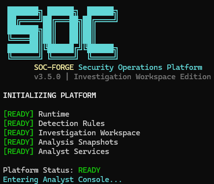

## What SOC-Forge Does

```text
Telemetry -> Rules and detections -> Alerts and cases -> Investigation
          -> Evidence -> Hypothesis -> Decision -> Finding
          -> Response Action -> Operations Queue -> Report or Handoff
```

- Detection Engineering provides rule inventory, explainability, explicit ATT&CK coverage, gaps, and controlled simulations.
- Investigations preserve evidence, hypotheses, decisions, Findings, and Response Actions in revisioned durable workspaces.
- Security Analysis projects threat activity, exact entities, ATT&CK observations, chronology, hunts, and cross-investigation overlap.
- The Operations Queue deterministically prioritizes open Response Actions and uncovered active Findings without becoming a second task database.
- Reporting separates human-readable reports from validated, integrity-checked Investigation Handoffs.
- System screens inspect local runtime, configuration, packaged assets, repository storage, and release identity without write probes.

## Platform Tour

### Command Center

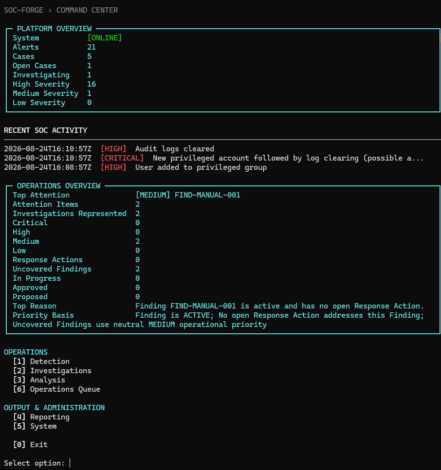

The Command Center summarizes current analysis and durable operational attention while keeping navigation grouped by workflow owner.

### Detection Engineering

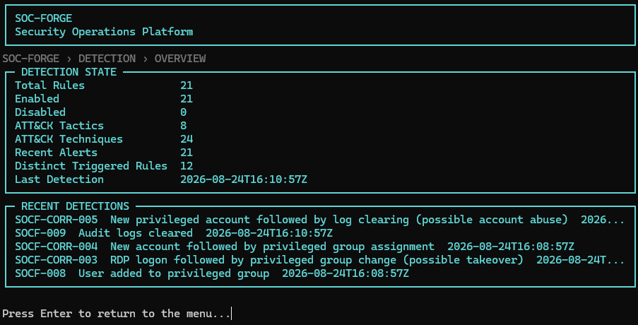

Rule Explainability translates configured logic, fields, aggregation, modifiers, ATT&CK mappings, and output into analyst-readable form.

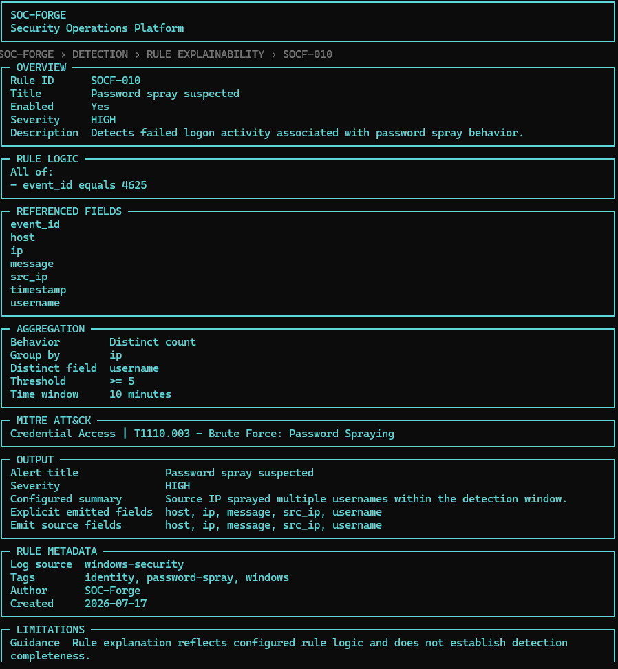

Coverage describes explicit mappings in the loaded ruleset; it is not a claim of complete security visibility or effectiveness.

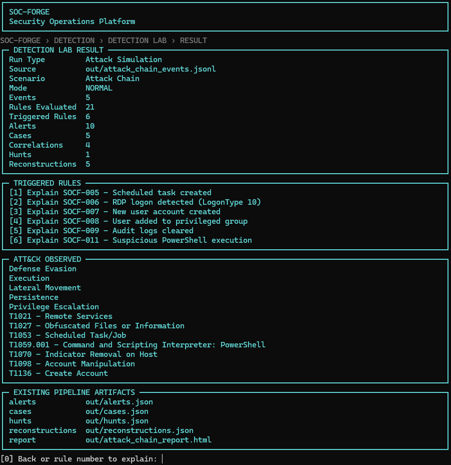

The Detection Lab runs controlled synthetic scenarios through the normal detection pipeline and links triggered rules to their explanations.

### Investigations


Investigation workspaces keep analyst reasoning durable even when matching machine analysis is unavailable. Findings are analyst-authored conclusions, not machine certainty.

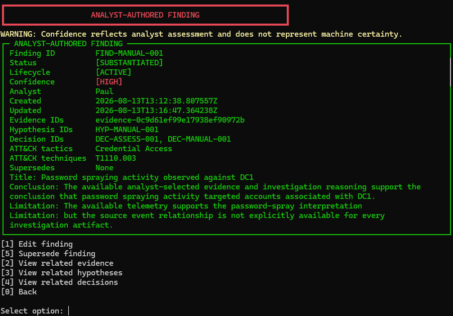

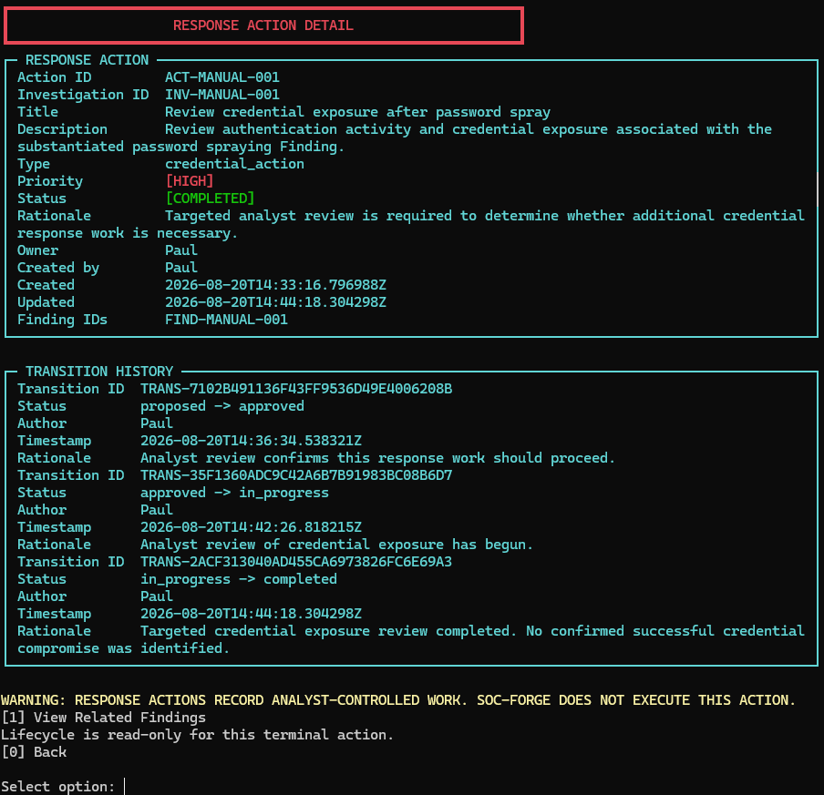

Response Actions record analyst-controlled response work. SOC-Forge does not execute remediation.

### Security Analysis

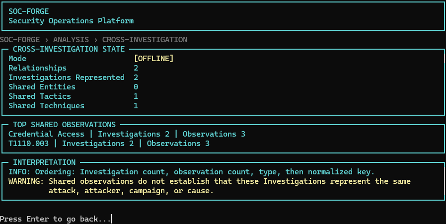

Overlap does not establish the same attacker, campaign, or cause. Temporal views order activity without inferring causality.

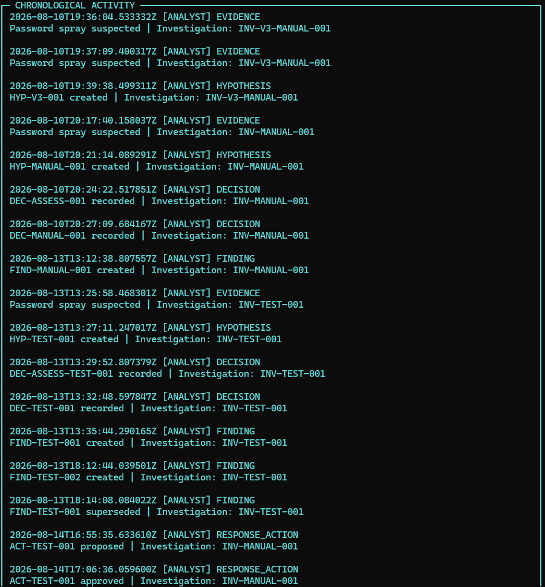

### Analyst Operations

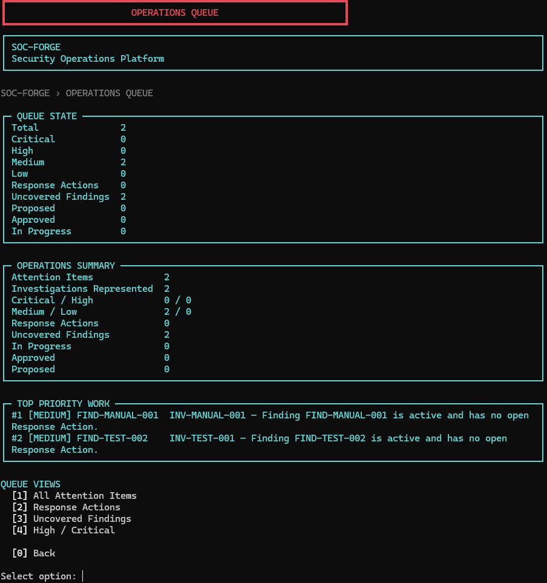

The queue is a read-only projection of authoritative Investigation state. Membership, order, and reasons are deterministic and explainable; there is no opaque score or queue-owned mutation.

### Reporting and Platform Health

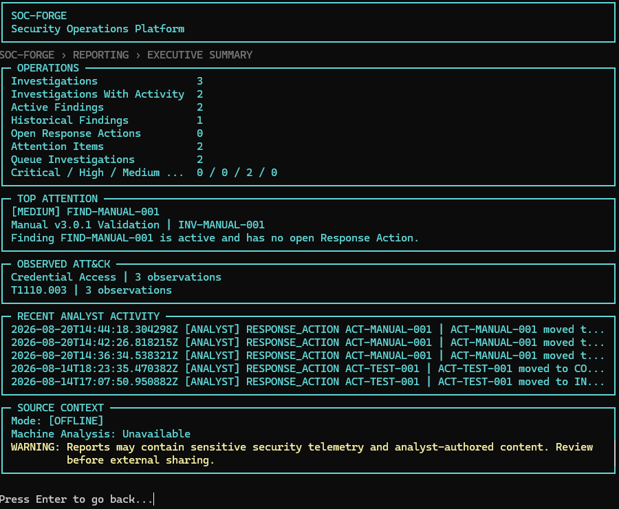

Investigation Reports are human-readable projections; Handoffs are structured, validated durable transfers.

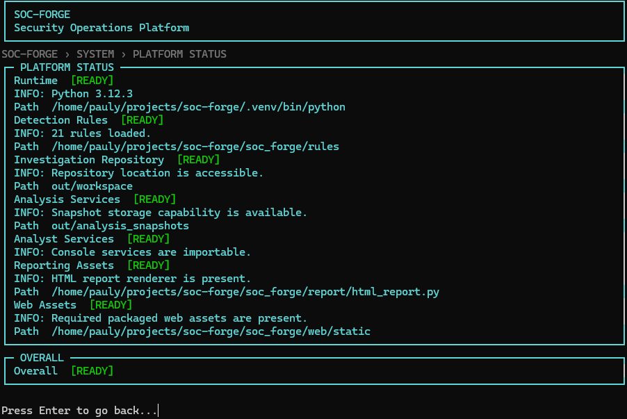

UNKNOWN means a safe read-only check could not establish a fact; it is not automatically a failure.

### Web Interface

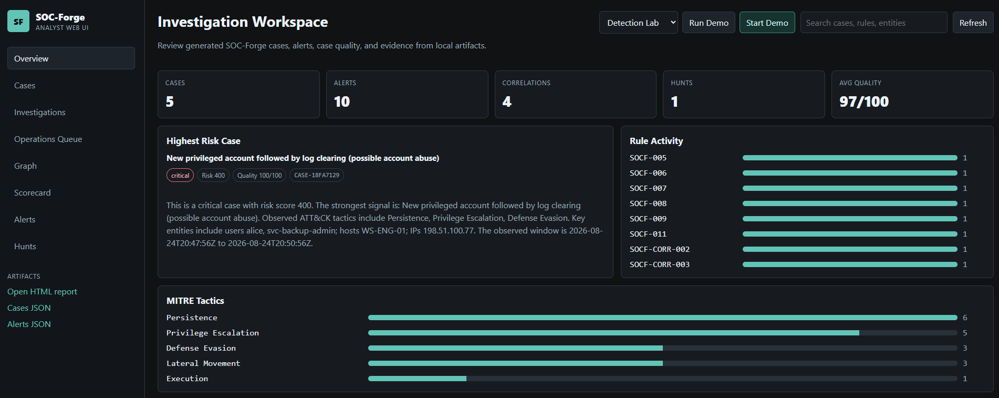

The local web interface supports dashboard and Investigation workflows, including safe Finding, Response Action, and Operations Queue views. Terminal-only areas remain in the analyst console.

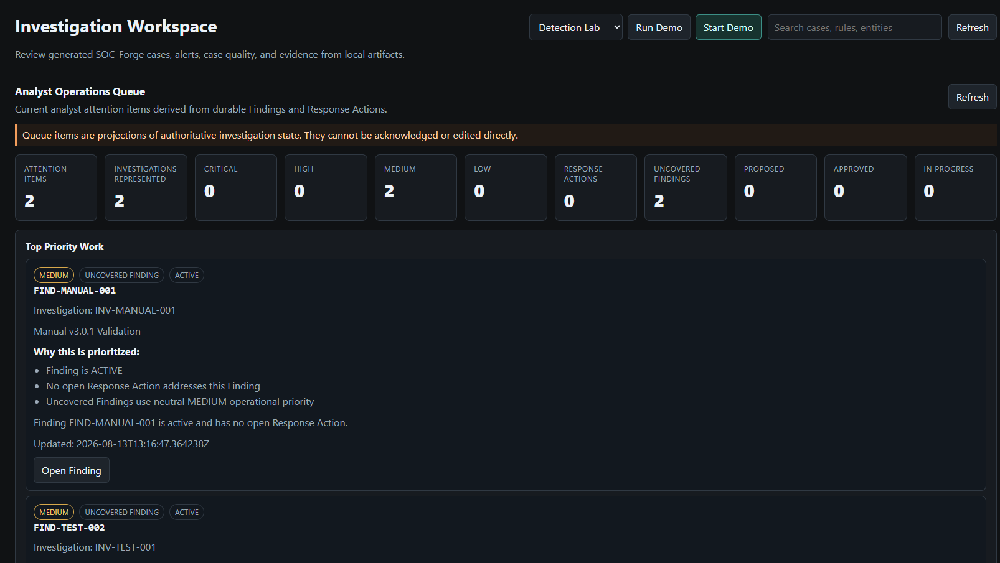

See the [complete v3.5 visual walkthrough](docs/walkthrough.md) for the full terminal and web tour.

## Core Capabilities

| Area | Capability |
| --- | --- |
| Detection | YAML rules, explainability, explicit ATT&CK coverage and gaps, simulations, alerts |
| Investigation | Revisioned workspaces, evidence, hypotheses, decisions, Findings, Response Actions |
| Analysis | Threat, entity, ATT&CK, cross-investigation, temporal, and hunt projections |
| Operations | Deterministic priority queue derived from durable Investigation state |
| Reporting | Report Center, Investigation Report, Executive Summary, validated Handoff |
| System | Read-only runtime, configuration, storage, environment, and asset inspection |
| Interfaces | Terminal console plus supported local web Investigation and operations workflows |

## Design Principles

- Deterministic projections with explicit ordering, counts, reasons, and no opaque scoring.
- Clear separation between machine observations and analyst-authored conclusions.
- Durable Investigation state independent of a loaded source analysis.
- **FULL** combines current machine analysis with durable analyst state; **OFFLINE** presents durable analyst state only and is not failure.
- Read-only analysis, queue, reporting, and system surfaces do not persist derived state.
- Response Actions document work; SOC-Forge does not run containment or remediation.

## Quick Start

SOC-Forge requires Python 3.10 or newer and is validated on Linux/WSL and macOS.

```bash
git clone https://github.com/paullydd/soc-forge.git
cd soc-forge
python3 -m venv .venv
source .venv/bin/activate
python -m pip install -e .
```

On Windows PowerShell, activate with `.venv\\Scripts\\Activate.ps1`.

```bash
soc-forge
soc-forge-web --port 8765
```

Open `http://127.0.0.1:8765`. The local server binds to loopback by default and has no authentication; do not expose it as a hosted service.

```bash
soc-forge --input sample_events.jsonl
soc-forge --input security_events.csv --format windows-security-csv
soc-forge --input security.evtx --format windows-security-evtx
soc-forge --simulate attack_chain --sim-output out/attack_chain_events.jsonl
```

Generated artifacts can contain sensitive telemetry and analyst content. Review them before sharing.

## Documentation

- [Full Visual Walkthrough](docs/walkthrough.md)
- [Architecture](docs/architecture.md)
- [Web Design System](docs/web_design.md)
- [Terminal UI](docs/terminal_ui.md)
- [Detection Engineering](docs/detection_engineering.md)
- [Security Analysis](docs/security_analysis.md)
- [Investigations](docs/investigation_domain.md)
- [Operations Queue](docs/operations_queue.md)
- [Response Actions](docs/response_actions.md)
- [Reporting](docs/reporting.md)
- [System Workspace](docs/system_workspace.md)
- [Investigation Handoff](docs/investigation_handoff.md)
- [Screenshot Index](docs/screenshots/README.md)
- [Release Notes](RELEASE_NOTES.md)

## Testing and Release

```bash
pytest --collect-only -q
pytest -q
```

Current release: **v3.5.0**. SOC-Forge is a local portfolio and analyst workflow platform, not a production monitoring service, hosted SIEM, or remediation engine.
