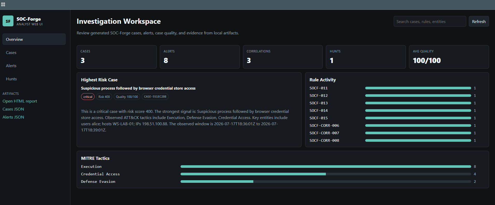
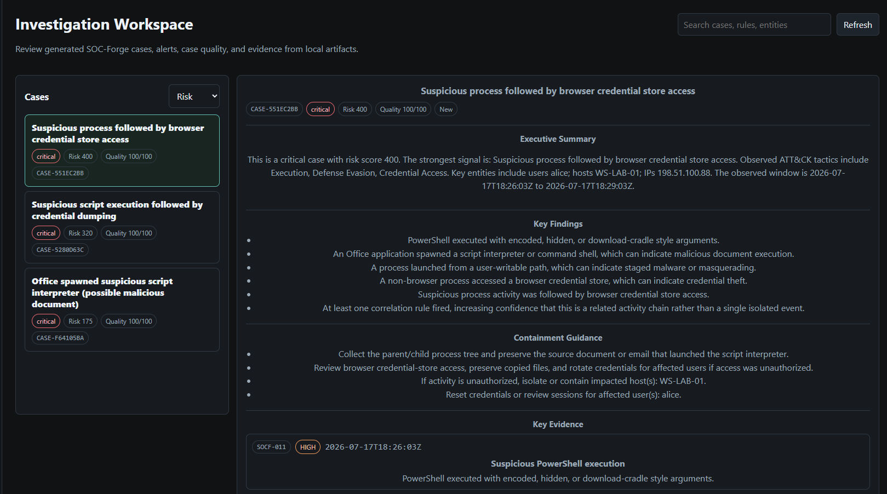
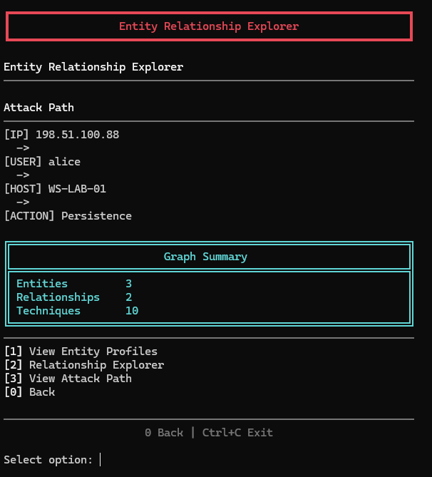
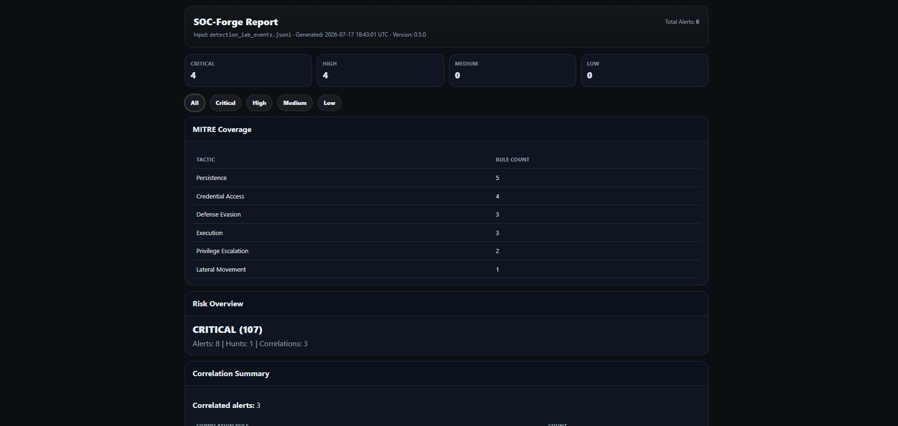

# SOC-Forge

SOC-Forge is a lightweight Security Operations Center (SOC) investigation platform written in Python. It processes security events, applies detection rules, correlates related alerts into cases, reconstructs attack activity, scores risk, and produces analyst-friendly reports and investigation artifacts.

The project is designed as a portfolio-ready SOC workflow: it shows detection engineering depth, analyst triage, attack reconstruction, case quality, graph analysis, and report export in one repeatable demo.

## What It Does

- Ingests JSONL security events, Windows Security CSV exports, and initial local Windows EVTX files
- Normalizes event data for analysis
- Runs YAML-based detection rules with MITRE ATT&CK mappings
- Runs a built-in brute-force detector for legacy compatibility
- Correlates related alerts into investigation cases
- Tracks case lifecycle fields including owner, status history, notes, timestamps, and evidence
- Builds timelines, IOC summaries, attack chains, and attack graphs
- Scores case risk and generates analyst summaries
- Exports alerts, hunts, cases, reconstructions, and HTML reports
- Includes attack simulation scenarios for demos and regression testing
- Provides a local web UI with scenario switching, guided demo flow, case review, graph view, alerts, hunts, and scorecard
- Provides a terminal analyst console for deeper case review workflows
- Supports case filtering, sorting, owner/status persistence, closure workflow, and investigation bundle export
- Adds case quality briefs with executive summaries, key findings, evidence rationale, containment guidance, and quality gaps
- Includes process-chain, credential-access, lateral-movement, persistence, and collection detections
- Scores detection engineering maturity across rule quality, MITRE coverage, evidence context, correlation depth, and demo readiness

## Product Positioning

The guided local web demo is the primary portfolio experience. It gives reviewers a fast, visual path through scenario generation, dashboard triage, case review, graph analysis, the detection scorecard, and the HTML incident report.

The terminal analyst console remains an optional deep-dive interface for replay, relationship exploration, lifecycle actions, and case export. The CLI remains the automation, simulation, coverage, and detection-engineering interface.

## Shared Analysis Pipeline

Both the CLI analysis path and the web demo scenario runner now use `soc_forge.pipeline`, so the same detection, correlation, hunt, risk, case, story, reconstruction, artifact, and report behavior powers both presentation layers.

```text
Input file or web scenario events
  -> Event loading / scenario generation
  -> Shared analysis pipeline
  -> YAML detection rules and legacy brute-force compatibility detection
  -> Correlations
  -> Hunts
  -> Risk scoring
  -> Case construction
  -> Case stories and attack reconstructions
  -> JSON artifacts and HTML report rendering
  -> Web UI or CLI presentation
```

## Main Components

```text
soc_forge/
  pipeline.py               Shared analysis pipeline used by CLI and web demos
  cli.py                    CLI commands for analysis, simulation, coverage, and rule quality
  config.py                 YAML-backed configuration
  models.py                 Shared alert and case normalization helpers
  ingest/                   Event loaders and converters
  rules/                    YAML detection rules and rule engine
  correlate/                Multi-alert correlation logic
  hunts/                    Hunt analytics
  scoring/                  Risk scoring
  reconstruct/              Attack reconstruction
  intelligence/             Summaries, scoring, and story generation
  investigations/           Analyst workspace helpers
  ui/                       Terminal UI panels and investigation views
  web/                      Local analyst web UI
  report/                   HTML report generation
  simulator/                Attack scenario generator
```

## Quick Start

Install the project in editable mode:

```bash
pip install -e .
```

Start the recommended local web demo:

```bash
python3 -m soc_forge.web.app --port 8765
```

Then open `http://127.0.0.1:8765`, choose `Detection Lab` or `Attack Chain`, and click `Start Demo`. The browser runs the selected scenario through the shared pipeline and refreshes the local artifacts in `out/`.

Run analysis against a JSONL, Windows Security CSV, or local Windows EVTX event file from the CLI. SOC-Forge auto-detects `.jsonl`, `.csv`, and `.evtx` by extension; use `--format` only when you need to override that detection.

Windows Security CSV imports accept common exported columns including `TimeCreated` or `Date and Time`, `Id` or `Event ID`, `Computer` or `Host`, `User` or `Username`, and `Message`. Initial EVTX ingestion uses the explicit format name `windows-security-evtx` or the shorter `evtx` alias, and extracts universal System metadata plus compact EventData values into the existing flat event model. During import, SOC-Forge reports bounded dataset diagnostics for missing timestamps, missing or invalid event IDs, malformed EVTX records, and missing optional context fields.

```bash
soc-forge --input sample_events.jsonl
soc-forge --input security_events.csv --format windows-security-csv
soc-forge --input security.evtx --format windows-security-evtx
soc-forge --input security.evtx --format evtx
soc-forge --input sample_events.jsonl --write-events out/normalized_events.json
```

Generate a demo attack scenario and analyze it from the CLI:

```bash
python3 -m soc_forge.cli --simulate mixed --sim-output out/simulated_events.jsonl
python3 -m soc_forge.cli --input out/simulated_events.jsonl --out out/alerts.json --html out/report.html

# Richer graph demo: RDP -> scheduled task -> new admin account -> log clearing
python3 -m soc_forge.cli --simulate attack_chain --sim-output out/attack_chain_events.jsonl
python3 -m soc_forge.cli --input out/attack_chain_events.jsonl --out out/alerts.json --html out/report.html

# Detection engineering demo: Office -> PowerShell -> credential access
python3 -m soc_forge.cli --simulate detection_lab --sim-output out/detection_lab_events.jsonl
python3 -m soc_forge.cli --input out/detection_lab_events.jsonl --out out/alerts.json --html out/report.html
```

Review generated artifacts:

```text
out/alerts.json
out/hunts.json
out/cases.json
out/reconstructions.json
out/report.html
out/normalized_events.json  # only when --write-events is used
```

Local safety note: SOC-Forge is a local analyst tool. The web server binds to `127.0.0.1` by default, has no authentication, and prints a warning if you explicitly bind it to a non-loopback host. Generated reports and JSON artifacts may contain sensitive telemetry such as usernames, hosts, IP addresses, command lines, and investigation notes. Review and redact artifacts before sharing them.

EVTX limitations: this is initial local ingestion support, not complete Windows Event Log compatibility. SOC-Forge does not collect live logs, connect to remote hosts, render every localized Windows message, or support every provider/channel. Normalized EVTX events keep compact parsed `raw` evidence and do not retain unbounded XML by default.

### Real EVTX Telemetry Demo

SOC-Forge includes a small public Windows System-channel EVTX fixture for initial Windows EVTX ingestion and investigation support. Run it with the normal CLI path:

```bash
python3 -m soc_forge.cli \
  --input tests/fixtures/evtx/system_service_demo.evtx \
  --out out/evtx-demo/alerts.json \
  --html out/evtx-demo/report.html \
  --write-events out/evtx-demo/normalized_events.json
```

The demo ingests 1,601 normalized Windows events and focuses on Service Control Manager activity. Existing SOC-Forge rules identify new service installation events and PsExec-style service execution evidence involving `PsExec` and `PSEXESVC.EXE`. The generated case is an analyst starting point: inspect the service names, image paths, host context, neighboring service state changes, and whether separate authentication telemetry is available to identify who initiated the activity.

This demo does not prove malicious intent by itself. The fixture is System-channel telemetry, so it does not include complete authentication context, endpoint process lineage, or network telemetry.


## Portfolio Demo Package

SOC-Forge now includes a portfolio-ready demo package that shows both analyst workflow and detection engineering depth:

- [Release package guide](docs/release_package.md)
- [Portfolio overview](docs/portfolio_overview.md)
- [Demo in 5 minutes](docs/demo_in_5_minutes.md)
- [Detailed attack-chain walkthrough](docs/demo_walkthrough.md)
- [Architecture diagrams](docs/architecture.md)
- [Case quality polish](docs/case_quality.md)
- [Detection engineering](docs/detection_engineering.md)
- [Rule quality](docs/rule_quality.md)
- [Web UI](docs/web_ui.md)
- [Checked-in sample artifacts](samples/attack_chain_demo/)

The attack-chain scenario demonstrates RDP activity, scheduled task persistence, service-style admin account creation, privileged group assignment, log clearing, correlated case generation, investigation replay, graph review, lifecycle tracking, and case export.

The detection-lab scenario demonstrates process-chain and credential-access detections: Office spawning PowerShell, execution from a user-writable path, LSASS dumping, browser credential-store access, and three related correlations.

## Screenshots

### Analyst Web UI Overview



### Case Detail And Findings



### Entity Relationship Explorer



### HTML Report Export



## Demo Walkthrough

For the primary portfolio demo, start the local web UI and use the guided demo:

```bash
python3 -m soc_forge.web.app --port 8765
```

Open `http://127.0.0.1:8765`, select `Detection Lab`, and click `Start Demo`. The current guided path is `Generate -> Dashboard -> Case -> Graph -> Scorecard -> Report`.

For an optional terminal deep dive, generate or load the attack-chain artifacts, then run:

```bash
python3 analyst_console.py
```

Then open `Investigations -> Investigation Workspace` and inspect replay, timeline, entity profiles, relationship evidence, next actions, and case closure/export.

A complete terminal walkthrough lives in [`docs/demo_walkthrough.md`](docs/demo_walkthrough.md). Sample generated artifacts live in [`samples/attack_chain_demo/`](samples/attack_chain_demo/).

## Rule Coverage

Print MITRE coverage for loaded rules:

```bash
soc-forge --coverage
```

Run rule quality checks before adding or showing detection content:

```bash
python3 -m soc_forge.cli --rule-quality
```

See [`docs/rule_quality.md`](docs/rule_quality.md) for the current rule quality standard.

Rules live in `soc_forge/rules` and use a YAML format with:

- Rule metadata
- Match conditions
- Severity and score
- MITRE ATT&CK mapping
- Optional score modifiers
- Optional emitted detail fields

## Local Web API

The local web server exposes the current workspace and demo controls through these routes:

```text
GET /api/workspace
GET /api/summary
GET /api/cases
GET /api/alerts
GET /api/hunts
GET /api/detection-scorecard
GET /api/reconstructions
GET /api/scenarios
POST /api/scenario
GET /artifact?file=report.html
GET /artifact?file=detection_lab_report.html
GET /artifact?file=cases.json
GET /artifact?file=alerts.json
GET /artifact?file=hunts.json
GET /artifact?file=reconstructions.json
```

`POST /api/scenario` expects `Content-Type: application/json` and supports `detection_lab` and `attack_chain`.

## Testing

Run the full test suite:

```bash
pytest -q
```

The suite covers detection rules, config loading, correlation, risk scoring, MITRE coverage, CSV ingestion, case enrichment, attack reconstruction, hunts, simulation, and shared model normalization.

## Future Work

These are intentionally postponed and are not current capabilities:

1. Add custom dataset loading to the web UI after the local demo and pipeline contracts remain stable.
2. Add saved analyst notes, ownership, and closure decisions to the web UI case workflow.
3. Add exportable graph images and case bundle formats after the existing HTML and JSON outputs stay stable.
4. Expand detection content into cloud identity, SaaS audit logs, and EDR-style process telemetry.
5. Add rule tuning metadata such as false-positive notes, data-source requirements, severity rationale, and test coverage status.

## Project Goals

SOC-Forge is built to explore and demonstrate:

- Detection engineering
- SIEM-style alert correlation
- SOC case triage workflows
- MITRE ATT&CK mapping
- Incident reconstruction
- Analyst-facing reporting

### Installed Package Detection Content

Built distributions include the YAML files under `soc_forge/rules`. The CLI, shared pipeline, and web detection scorecard resolve that installed rules directory through the package rather than relying on the current working directory. The release packaging test builds and installs a wheel in an isolated environment, loads the built-in rules outside the source checkout, and verifies a known event triggers a built-in rule.

### Endpoint Detection Interpretation

Process detections SOCF-020, SOCF-021, and SOCF-022 support native Windows Security Event ID 4688. Their Sysmon Event ID 1 branches require the `Microsoft-Windows-Sysmon` provider so unrelated Event ID 1 records are not treated as Sysmon process creation.

Reconstruction presents SOCF-020 as Collection, SOCF-021 as Defense Evasion, and SOCF-022 as Impact. These command-line detections are investigation signals, not proof of malicious intent. Legitimate administration, backup maintenance, and disaster-recovery testing may generate alerts. Alternate tools or command syntax may bypass string-based matching, and command-line evidence can contain sensitive arguments that should be reviewed before artifacts are shared.
