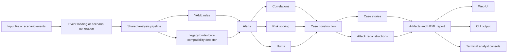
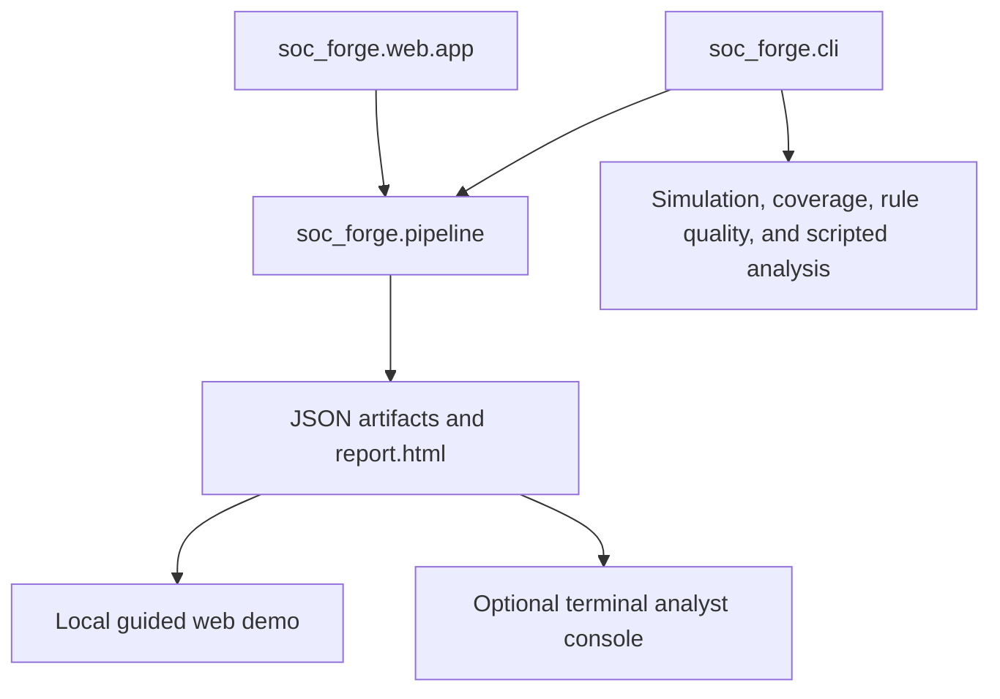
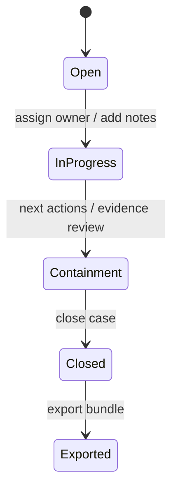

# SOC-Forge Architecture

SOC-Forge is organized around one shared local analysis pipeline. Input events can come from a CLI file input or from a web demo scenario, but both paths use the same detection, correlation, hunt, risk, case, reconstruction, artifact, and report behavior.

## Pipeline View



## Presentation Layers



## Data Flow

```text
Input JSONL, Windows Security CSV, or local Windows EVTX
  -> event dictionaries plus CSV/EVTX import diagnostics when dataset quality issues are found
  -> optional normalized event export from CLI file analysis
  -> shared analysis pipeline
  -> YAML rule alerts plus legacy brute-force compatibility alerts
  -> correlation alerts
  -> hunt findings
  -> risk summaries
  -> cases from soc_forge.cases.builder
  -> case stories and attack reconstructions
  -> alerts.json, cases.json, hunts.json, reconstructions.json, report.html
  -> optional normalized_events.json when CLI --write-events is used
  -> web UI, CLI summaries, or optional terminal console review
```

## Component Map

```text
soc_forge/pipeline.py             Shared analysis pipeline and artifact writing
soc_forge/cli.py                  CLI for file analysis, simulation, coverage, and rule quality
soc_forge/web/app.py              Local web API and scenario runner
soc_forge/ingest/                 Event loading, CSV diagnostics, and initial EVTX normalization
soc_forge/rules/                  Detection rule content, engine, quality, coverage, and legacy detector
soc_forge/correlate/              Alert correlation logic
soc_forge/hunts/                  Hunt analytics
soc_forge/scoring/                Risk scoring
soc_forge/cases/                  Case construction, quality, lifecycle, and persistence helpers
soc_forge/intelligence/           Case story generation
soc_forge/reconstruct/            Attack reconstruction
soc_forge/investigations/         Replay, timeline, workspace, and exports
soc_forge/core/                   Entity intelligence and investigation graph helpers
soc_forge/ui/investigation/       Optional terminal investigation views
soc_forge/report/                 HTML report rendering
soc_forge/simulator/              Demo attack scenario generation
samples/attack_chain_demo/        Reviewable sample artifacts
```

## Case Lifecycle



## Design Notes

SOC-Forge favors readable local artifacts over hidden state. Alerts, cases, reconstructions, hunts, reports, and investigation bundles are written to disk so they can be inspected, tested, and shared.

The guided web demo is the primary portfolio experience. The terminal analyst console is still supported as an optional deep-dive workflow for replay, entity relationships, lifecycle actions, and exports. The CLI remains the automation and detection-engineering interface.

SOC-Forge is local-only by design. The web server binds to `127.0.0.1` by default, has no authentication, and warns when explicitly bound to a non-loopback host. Generated artifacts may contain sensitive telemetry and should be reviewed or redacted before sharing.

Initial EVTX support stays inside the ingestion layer. The pipeline recognizes `.evtx`, the explicit `windows-security-evtx` format, or the shorter `evtx` format alias, calls the EVTX loader, and receives the same flat event dictionaries used by JSONL, CSV, simulation, CLI output, reports, and cases. EVTX rendering is intentionally limited: parsed events retain compact System/EventData evidence, not unbounded raw XML or guaranteed localized Windows-rendered messages. The checked-in EVTX service telemetry demo uses this same path and writes the same alerts, cases, reconstructions, normalized-event export, and HTML report artifacts as other CLI file inputs.
