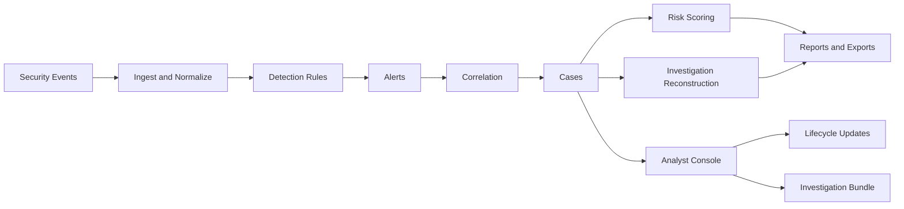
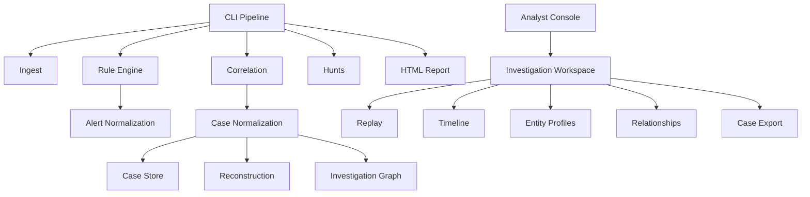
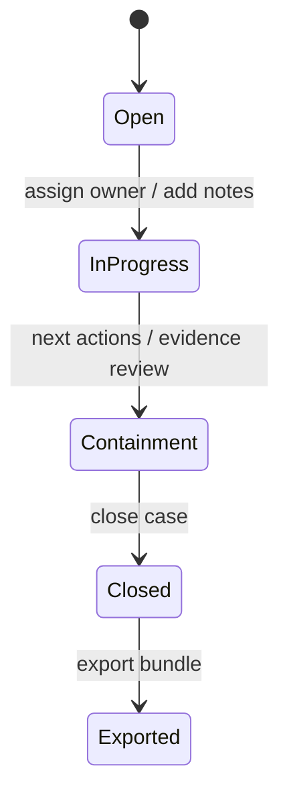

# SOC-Forge Architecture

SOC-Forge is organized as a small SOC investigation pipeline. The design keeps each step understandable: input events become normalized records, rules create alerts, correlation creates cases, and investigation modules turn those cases into analyst-facing context.

## Pipeline View



## Component Map



## Case Lifecycle



## Data Flow

```text
Input event file
  -> normalized event dictionaries
  -> rule alerts
  -> correlated alerts
  -> case records
  -> reconstructions, hunts, risk scores, graph data
  -> HTML report, JSON artifacts, analyst exports
```

## Important Directories

```text
soc_forge/cli.py                  Command-line orchestration
soc_forge/ingest/                 Event loading and conversion
soc_forge/rules/                  Detection rule content and engine
soc_forge/correlate/              Alert correlation logic
soc_forge/cases/                  Case lifecycle and persistence helpers
soc_forge/investigations/         Replay, timeline, workspace, and exports
soc_forge/core/                   Entity intelligence and investigation graph helpers
soc_forge/ui/investigation/       Console investigation views
soc_forge/report/                 HTML report generation
soc_forge/simulator/              Demo attack scenario generation
samples/attack_chain_demo/        Portfolio sample artifacts
```

## Design Notes

SOC-Forge favors readable local artifacts over hidden state. Alerts, cases, reconstructions, hunts, reports, and investigation bundles are written to disk so they can be inspected, tested, and shared.

The analyst console is intentionally terminal-based for now. That keeps the project focused on pipeline quality and investigation behavior before adding a browser UI layer.
