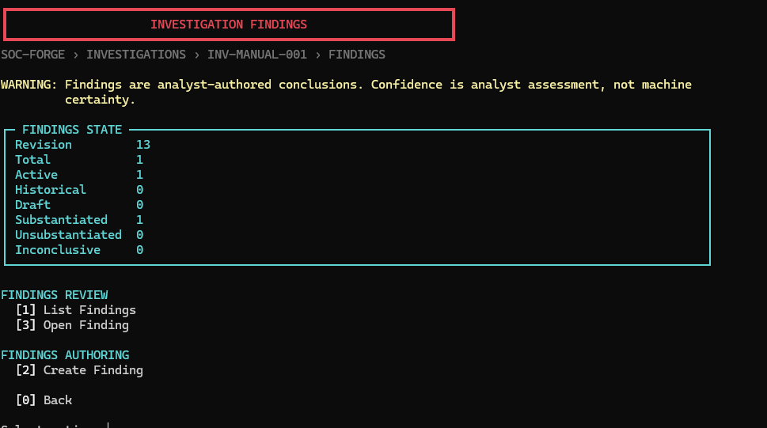

# Investigation Findings

An investigation finding is a durable, explicitly analyst-authored conclusion grounded in persisted investigation evidence and reasoning. It is not a detection, machine verdict, automated recommendation, or confirmation that an attack occurred.

## Domain Boundary

Machine analysis -> analyst-selected evidence -> hypotheses and decisions -> InvestigationFinding -> durable Investigation repository.

Detections describe machine-observed signals. Evidence records what an analyst selected and how it was classified. Hypotheses remain analyst assessments. Decisions record reasoning actions. Findings express a bounded analyst conclusion and cite at least one existing analyst-selected evidence item, hypothesis, or investigation decision.

## Controlled State

Status is one of `draft`, `substantiated`, `unsubstantiated`, or `inconclusive`. Confidence is `low`, `medium`, or `high`. High confidence remains an analyst assessment, not machine certainty.

## Relationships

Finding evidence IDs must name analyst-selected evidence in the same investigation. Scope-only references are not sufficient. Hypothesis and decision IDs must exist in the same investigation. Unknown, foreign, malformed, or duplicate relationship IDs are rejected. At least one evidence, hypothesis, or decision reference is required.

ATT&CK tactics and techniques are optional analyst-supplied context. Durable affected-entity references are deferred because current web entity IDs are intentionally transient transport identifiers.

## Content and Sensitivity

Titles, conclusions, authors, timestamps, and limitations are bounded. The service never copies raw event messages, command lines, usernames, hosts, IP addresses, or protected evidence values into finding prose. Analysts remain responsible for text they deliberately enter.

## Persistence and Revisions

Findings are frozen models stored in the existing `Investigation` aggregate. Create and material update operations use optimistic revision checks and increment revision exactly once. No-op updates preserve revision and bytes. Reads do not write.

Older records load with an empty findings tuple. Findings are not stored in completed-analysis snapshots and do not modify `AnalysisResult` or artifacts.

## Offline Behavior

Findings remain readable after restart and when source analysis is unavailable. The service accepts no `AnalysisResult`, performs no enrichment, and cannot rebind an investigation. Investigation Summary and Handoff consume this durable state without changing its storage model. Findings remain visible in FULL and OFFLINE summaries, always with analyst attribution and analyst-confidence wording. Handoff schema `1.2` exports lifecycle history in the separately validated `findings.json` component; legacy `1.0` bundles remain readable without that component.

## Console Workflow

Open a durable investigation and select **Investigation Findings**. The nested screen lists, creates, opens, and edits findings through `InvestigationFindingService`. Relationship prompts show numbered analyst-selected evidence, hypotheses, and decisions; no reference is selected automatically. Finding detail delegates evidence and reasoning review to the existing protected controllers. Back moves one level and no delete action exists.

## Web Workflow

The local Investigation Workspace includes an **Investigation Findings** section labeled as analyst-authored conclusions. Counts cover all controlled statuses. List, detail, create, and edit views use safe DOM construction. Relationship choices come from the durable investigation and protected evidence is not revealed by finding presentation.

Routes:

- `GET /api/investigations/{id}/findings`
- `GET /api/investigations/{id}/findings/{finding_id}`
- `POST /api/investigations/{id}/findings`
- `PUT /api/investigations/{id}/findings/{finding_id}`

Responses use `Cache-Control: no-store`. Reads and offline mutations do not require active analysis. Create and material updates increment revision once; no-op updates do not. Snapshot activation does not alter findings.

Terminal scrollback and browser presentation can retain analyst-authored finding text. Raw protected evidence remains behind the existing explicit evidence reveal flow. There is no delete operation. Durable affected-entity references remain deferred. Summary and Handoff presentation never reveals protected evidence values automatically.

## Finding Lifecycle and Supersession

Analytical status and lifecycle state are separate. Status records the analyst assessment; lifecycle records whether that conclusion is currently authoritative. Findings default to active. An analyst may explicitly supersede an active Finding with another active Finding, recording a bounded reason, author, and timestamp without changing either Finding's status or confidence.

Supersession links both Findings in one revision-aware transaction and increments the investigation revision exactly once. Failed or stale operations do not write. Superseded Findings remain durable, read-only history; active Findings retain the existing edit behavior. Existing records without lifecycle fields load as active without being rewritten. Chains are supported when each replacement is active and the resulting graph remains cycle-free.

Summary narrative is driven only by active Findings and reports active and historical counts. Handoff schema 1.2 preserves and validates lifecycle links and audit metadata. Schema 1.1 bundles without lifecycle metadata remain compatible and load their Findings as active; schema 1.0 compatibility remains unchanged.

The console and web interfaces separate active and historical Findings and require explicit confirmation for supersession. Lifecycle remains available offline and completed-analysis snapshot activation never changes it. There is no deletion, automatic supersession, or machine-generated lifecycle transition.

## Terminal Presentation

The terminal Findings workspace uses the shared v3.2 breadcrumb and authoritative Finding counts. Active Findings and historical or superseded Findings appear in separate sections, with lifecycle state retained as text when ANSI color is unavailable. Historical Findings remain readable and read-only.

Finding cards and details preserve status, confidence, analyst attribution, basis references, ATT&CK context, limitations, and supersession history. Existing create, edit, drill-down, confirmation, and atomic supersession behavior remains owned by `InvestigationFindingService` and its controller.
