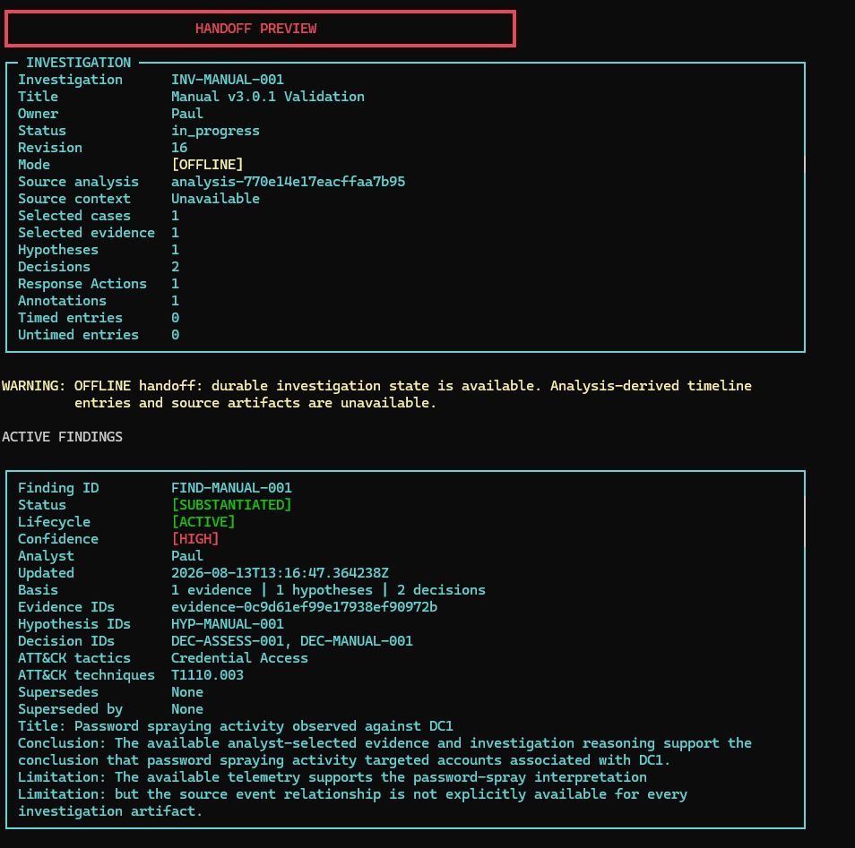
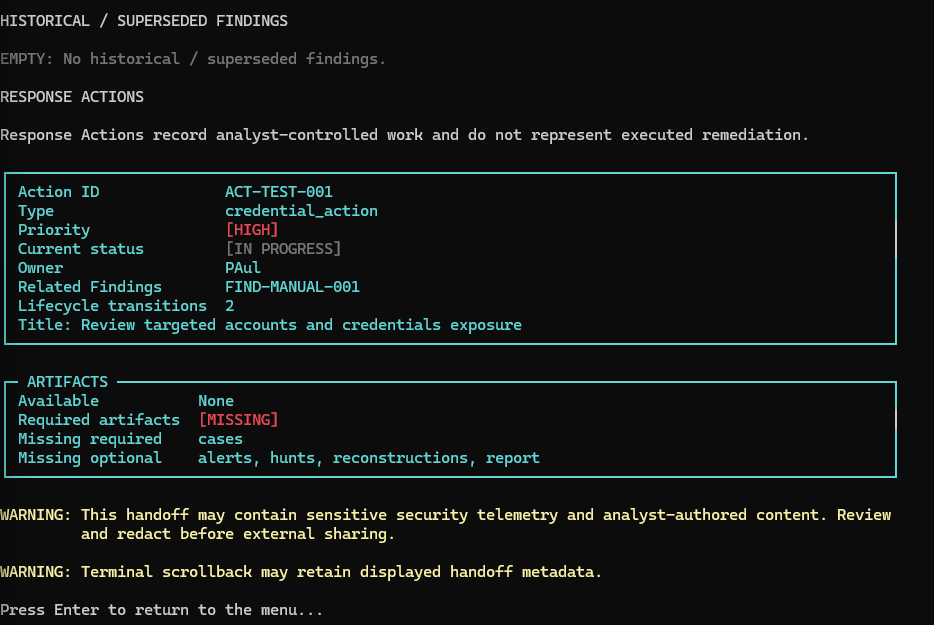
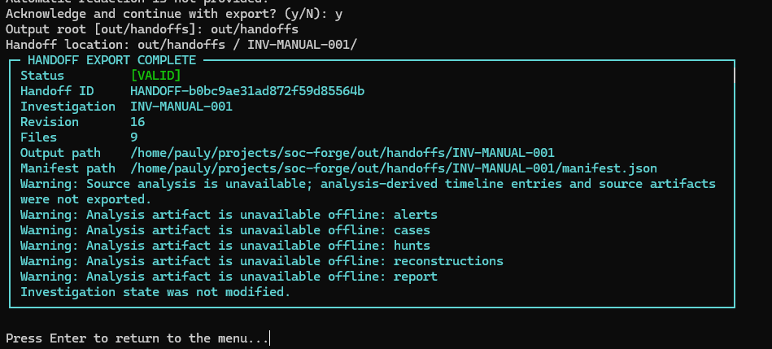
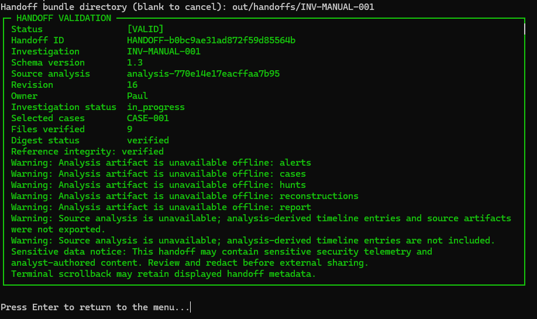

# Investigation Handoff Packages

## Visual workflow

An offline Handoff can preview and export durable investigation state without an active source analysis. That durable state includes Findings, Response Actions, and their complete transition histories. SOC-Forge does not reconstruct unavailable analysis: analysis-derived timeline data and source artifacts remain unavailable and are reported as limitations.









## Purpose and Boundary

A handoff package is a read-only snapshot of one durable investigation revision
and its referenced analysis context. Creating a handoff does not modify the
investigation or analysis artifacts.

The reusable boundary is:

```text
Completed AnalysisResult + Durable Investigation
  -> InvestigationQueryContext
  -> InvestigationTimelineService
  -> InvestigationHandoffService
  -> deterministic directory bundle
```

The handoff service validates provenance, projects durable analyst state, uses
the shared scoped timeline, copies approved analysis artifacts, writes integrity
metadata, and validates the completed bundle. It does not run detections,
correlations, hunts, case construction, or the analysis pipeline. It does not
change evidence, hypotheses, decisions, annotations, status, ownership, or
repository state.

## Directory Contract

Slice 1 produces a plain directory rather than ZIP or TAR:

```text
<output-root>/<investigation-id>/
  manifest.json
  investigation.json
  evidence_index.json
  hypotheses.json
  decisions.json
  findings.json
  response_actions.json
  annotations.json
  timeline.json
  limitations.json
  source_artifacts/
    alerts.json
    cases.json
    events.json
    hunts.json
    reconstructions.json
    report.html
```

Only artifact files present in the completed analysis are copied. JSON uses
UTF-8, sorted keys, two-space indentation, and one trailing newline. Lists with
no semantic source order are sorted explicitly. Exports of identical analysis
content and the same investigation revision are byte-for-byte deterministic.

The default re-export policy is to fail if the target investigation directory
already exists. Callers must explicitly request overwrite. Export content is
built in a staging directory and published only after validation and the final
revision check.

## Manifest and Identity

New `manifest.json` files use schema version `1.2` and contain:

- deterministic handoff ID
- investigation and source-analysis IDs
- provenance algorithm and version
- exact investigation revision
- deterministic creation timestamp from the investigation snapshot
- owner and status
- selected case IDs
- logical artifact references
- the existing handoff identity manifest projection
- creation tool and package version
- limitations and the sensitive-data warning
- an inventory containing filename, logical type, byte size, and SHA-256 for
  every component except `manifest.json`

The handoff ID is SHA-256 derived from schema version, investigation ID,
source-analysis ID, revision, selected cases, selected evidence identity and
classification, evidence rationale, hypothesis IDs and states, decision IDs,
Finding IDs, annotation IDs, and timeline-selection IDs. It does not include output paths,
temporary paths, dictionary insertion order, file ordering, or an export-only
clock value.

Handoff IDs identify an investigation revision and its selected investigation
identities. They are not a cryptographic content address for every byte in the
bundle. Revision-aware workspace services remain authoritative for material
investigation changes.

Workbench opaque entity IDs are not exported because they are transient browser
transport identifiers, not durable investigation references.

## Investigation and Evidence

`investigation.json` contains bounded workspace metadata, selected case IDs,
source-analysis ID, revision, and current query limitations. It is not the
repository envelope and contains no repository path.

`evidence_index.json` separates analyst-selected evidence from case-scope
references. Analyst selections retain classification, rationale, author,
selection timestamps, related case IDs, sensitive-field indicators, and a
bounded provenance summary. Scope references are not described as reviewed
analyst evidence. Raw event and alert payloads are not embedded in the evidence
index.

## Findings

`response_actions.json` preserves durable analyst-controlled Response Actions, including investigation and Finding relationships, title, description, type, priority, current status, owner, creator attribution, rationale, timestamps, and complete immutable transition history. Validation checks Action IDs, Finding references, transition uniqueness and continuity, and agreement between the final transition and current status. Links to Findings that were later superseded remain historically valid.

`findings.json` preserves durable analyst-authored Findings, including title, conclusion, controlled status, analyst confidence, author and timestamps, evidence/hypothesis/decision basis IDs, optional ATT&CK context, and limitations. It does not resolve or copy protected evidence values. Finding confidence is analyst assessment, not machine certainty. Durable affected-entity references remain deferred.

The validator reconstructs each Finding through the authoritative domain model, rejects malformed payloads, duplicate IDs, invalid status or confidence, and verifies every evidence, hypothesis, and decision reference against the included handoff components. The component participates in logical-type, size, and SHA-256 validation.

Schema `1.0` bundles created before Findings integration remain valid without `findings.json`. Schemas `1.1`, `1.2`, and `1.3` require it, including for investigations with zero Findings. Schema `1.1` Findings without lifecycle metadata load as active. New exports always use `1.3`; the compatibility reader does not invent Findings for older bundles.

## Reasoning and Annotations

`hypotheses.json` preserves analyst statements, current states, author and
timestamps, supporting and contradicting evidence IDs, and assessment decision
references. A supported hypothesis remains an analyst assessment rather than an
objective fact.

`decisions.json` preserves every durable decision's stored type, outcome,
rationale, author, timestamp, and evidence or hypothesis references. Unknown
legacy decision types remain unchanged.

`annotations.json` preserves target identity, author, text, and timestamps.
Annotation text is explicitly marked sensitive analyst-authored content.

## Timeline

`timeline.json` is produced through the shared read-only timeline service. It
contains the complete deterministic scoped timeline, separated into timed and
untimed entries. Entries retain stable source and evidence identities, bounded
summary, machine or analyst context, case IDs, normalized entity fields, rule
and ATT&CK fields, evidence and reasoning overlays, relationship reason, and
sensitive-field indicators. Full command lines, raw source messages, annotation
bodies, and analyst rationale are not copied into timeline entries.

Persisted `TimelineSelection` metadata is included when present. Slice 1 does
not add selection mutation workflows. Transient entity transport IDs are
excluded from selection export.

## Artifact Policy and Path Safety

The artifact allowlist is:

- `alerts`
- `cases` (required)
- `events`
- `hunts`
- `reconstructions`
- `report`

Unknown logical keys fail export. Missing `cases` fails export; another missing
allowlisted artifact is recorded as a limitation. Artifact sources must be
regular, non-symlink files below the completed analysis output root. Fixed safe
destination names prevent caller-controlled filenames from entering the bundle.
Copied bytes are hashed and compared with their source.

Investigation IDs must be safe single path segments. Output roots and inventory
members are resolved and checked against their approved roots. Absolute member
paths, parent traversal, backslash member names, symlink escapes, and unexpected
files are rejected. Workspace repository files are never artifact candidates.

## Revision Consistency

The service loads one authoritative repository revision, constructs the bundle
from that immutable investigation snapshot, then reloads the record before
publication. A revision or aggregate change produces a controlled conflict and
the staged bundle is removed. This is a local consistency check, not locking or
transaction isolation.

## Integrity Validation

`validate_handoff_bundle(path)` requires no original repository. It verifies:

- manifest presence and supported schema
- required component presence
- safe inventory paths and absence of unexpected files
- recorded size and SHA-256 for every inventoried file
- investigation and analysis identity alignment
- hypothesis-to-evidence references
- assessment-decision references
- decision-to-evidence and decision-to-hypothesis references
- timeline hypothesis and decision references
- Finding model validity, unique IDs, and evidence/hypothesis/decision references

Future validator hardening may additionally check annotation targets,
scope-to-case references, remaining timeline evidence and case references,
identity-manifest recomputation, and handoff-ID recomputation. These checks are
not claims of cryptographic authenticity and are not performed in v3.0.

The integrity manifest is not a digital signature and does not establish
authenticity against a malicious party who can rewrite both files and manifest.
Digital signing is outside Slice 1.

## Sensitive Data and Limitations

> This handoff may contain sensitive security telemetry and analyst-authored
> content. Review and redact before external sharing.

Slice 1 does not automatically redact content. It centralizes evidence,
hypothesis, decision, annotation, and timeline serializers so a later explicit
redaction policy can be applied without changing analysis or investigation
models.

The handoff capability provides console and local web controls, but no upload,
cloud sharing, email delivery, authentication, digital signature, archive
packaging, or hosted behavior.
## Analyst Console Workflow

Open a durable investigation in **Investigation Workspaces**, then select
**Investigation Handoff (Read Only)**. The console workflow is:

```text
Open investigation
  -> Investigation Handoff
  -> Preview
  -> Review sensitivity warning
  -> Export
  -> Inspect manifest
  -> Validate bundle
```

Preview requires the active completed analysis whose provenance matches the
investigation. It shows the authoritative revision, selected-case and
analyst-state counts including bounded analyst Findings, timed and untimed timeline counts, artifact availability,
and sensitive-data warning without writing a bundle. Missing or mismatched
active analysis blocks preview and export; analysis is never rerun and artifact
paths are never guessed from disk.

The default output root is `out/handoffs`. An analyst may enter another root;
the handoff service remains responsible for traversal, symlink, artifact, and
publication safety. The console displays the conceptual final location as the
selected root plus the investigation ID and does not construct artifact-copy
paths.

Export requires explicit acknowledgement that the bundle may contain usernames,
hosts, IP addresses, evidence rationale, hypotheses, decisions, annotations,
and other sensitive content. Blank confirmation cancels. There is no automatic
redaction.

An existing target is never overwritten by default. The analyst can cancel,
choose another root, or explicitly request overwrite and confirm it separately.
The console does not delete the old bundle; the service stages and validates the
replacement before publication and restores the prior directory if publication
fails.

After export, **View last handoff result** reads the validated manifest and shows
the schema, handoff and investigation identities, revision, selected cases,
bounded limitations, and file inventory with sizes and SHA-256 digests. This is
session state only. Handoff history is not persisted in the investigation and
export does not increment its revision.

**Validate handoff bundle** works without an active analysis. It invokes the
shared offline validator and reports schema, digest, and reference-integrity
status without printing raw file contents or tracebacks. Validation does not
repair or modify a damaged bundle. An analyst can manually alter a copied file
to demonstrate digest failure, then explicitly re-export with overwrite to
restore a valid package.

If the investigation changes during export, the service rejects the staged
snapshot and publishes no mixed-revision directory. The console does not retry
or merge; the analyst must refresh the workspace and start export again.

> The analyst console delegates handoff construction and validation to the
> shared handoff service. It does not serialize, hash, copy, or validate bundle
> contents independently.

Preview, manifest inspection, and validation remain read-only. A successful
export writes only the new handoff bundle: repository bytes, investigation
revision and state, completed `AnalysisResult`, and source artifacts remain
unchanged. Terminal scrollback may retain displayed handoff metadata.

Slice 3 adds web controls but no archive format, persistent handoff history,
automatic sharing, redaction, or signing.


## Web Investigation Workflow

Open a durable investigation and use **Investigation Handoff - Read Only**:

```text
Open investigation
  -> Investigation Handoff
  -> Preview
  -> Review sensitivity warning
  -> Export
  -> Inspect manifest
  -> Validate
```

Preview and export require the server-owned completed analysis whose provenance matches the investigation. Preview is bounded and performs no writes. The web export root is fixed to `<analysis-output>/handoffs`; the browser cannot submit an absolute path, parent traversal, source-artifact path, or bundle file list. Responses identify a bundle with a safe relative value such as `handoffs/INV-001`, never an absolute source path.

Export requires the current investigation revision and explicit acknowledgement of the sensitive-data warning. Existing targets fail by default. Overwrite must be selected and confirmed explicitly; the shared service stages and validates the replacement before publication. A revision conflict refreshes the workspace separately and is never retried automatically.

Manifest inspection returns schema and provenance metadata, selected cases, and the bounded file inventory with sizes and SHA-256 digests. Validation calls the shared offline validator and reports valid or invalid with bounded categories for digest mismatch, missing files, unsupported schema, and reference-integrity failure. It does not display tampered content, repair files, or require an active analysis, so an existing bundle can be validated after server restart.

All handoff API responses use `Cache-Control: no-store`. Returned data is rendered with DOM text insertion. Analyst rationale, statements, annotations, source paths, and other handoff content are not put in request URLs or browser storage.

> Web handoff controls delegate construction and validation to the shared `InvestigationHandoffService`. The browser does not serialize, hash, copy, or validate handoff files independently.

Console and web exports of the same investigation revision and analysis have the same handoff ID, manifest semantics, file inventory, hashes, warnings, and validation result. Their selected output roots may differ.

The web handoff has no archive or download endpoint, upload, email or cloud sharing, automatic redaction, digital signature, authentication, or hosted workflow. Review the generated handoff before sharing it outside the intended environment.

## Terminal Presentation

The terminal Handoff workspace uses the shared v3.2 breadcrumb, read-only state panel, structured preview, export result, manifest, and validation panels. Active Findings and historical or superseded Findings remain separate, and supersession metadata remains visible. Artifact availability preserves the service's required and optional classifications.

Sensitive telemetry and analyst-content warnings remain authoritative, and export still requires explicit acknowledgement with the same default. Existing-target handling retains cancel, alternate-root, and confirmed-overwrite paths; replacement occurs only after a new bundle is fully staged and validated. Preview, export, validation, and result rendering do not change investigation revision or repository content.

Validation expects a concrete bundle directory such as `out/handoffs/INV-TEST-001`, not the parent `out/handoffs` root. Schema 1.2, 1.1, and 1.0 compatibility remains unchanged; validation does not rewrite or upgrade older bundles. Width and no-color presentation never replace textual status meaning.

## Offline handoffs

Handoff preview and export remain available when the matching completed source analysis is not active. OFFLINE handoffs export durable investigation metadata, evidence references and analyst state, hypotheses, decisions, annotations, Findings, Response Actions, and complete Action transition histories. They do not reconstruct analysis output. Analysis-derived timeline entries and source artifacts are represented as unavailable through the preview, manifest mode, missing-artifact fields, and limitations. FULL handoffs continue to validate provenance and include available source artifacts and timeline context. Both modes are read-only and preserve investigation revision and repository bytes.
