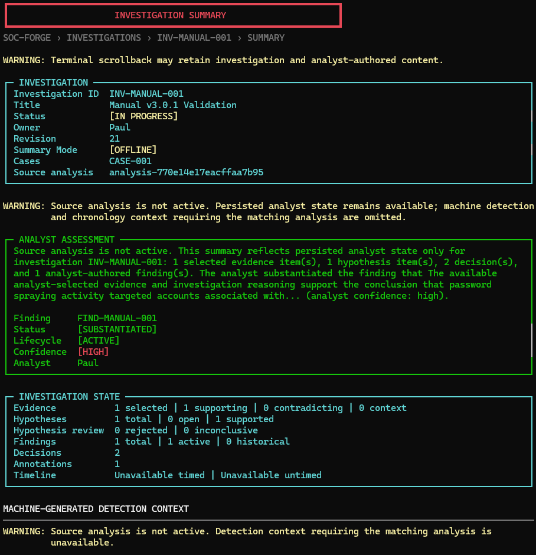

# Investigation Summary

See the [v3.6 product walkthrough](walkthrough.md) for the current end-to-end interface tour.



The investigation summary is a deterministic, read-only projection of one durable investigation. It condenses existing machine findings and analyst-authored reasoning for presentation without creating conclusions, changing investigation state, or rerunning analysis.

## Ownership

```text
InvestigationWorkspaceService
  + optional matching AnalysisResult
  -> InvestigationQueryContext
  -> InvestigationTimelineService
  -> InvestigationSummaryService
  -> immutable InvestigationSummary
  -> web presentation
```

`InvestigationSummaryService` owns summary composition. It loads durable state through `InvestigationWorkspaceService`, validates an optional completed analysis with `InvestigationQueryContext`, and delegates chronology to `InvestigationTimelineService`.

The service does not run detections, build cases, infer attacks, generate scores, call an LLM, create hypotheses, or mutate the repository, investigation revision, analysis result, or artifacts.

## Public API

```python
service = InvestigationSummaryService(workspace_service)
summary = service.summarize(investigation_id, analysis=None)
```

The result and all nested models are frozen dataclasses. `to_dict()` provides a deterministic structured representation. No generation timestamp is included.

## Full And Offline Modes

Durable analyst-authored Findings are included in both modes. Their persisted status, analyst confidence, basis counts, ATT&CK context, and limitations remain visible without resolving protected evidence values. Findings are never stored in or recovered from completed-analysis snapshots.

**Full mode** requires the exact matching `AnalysisResult`. It includes selected case titles, relevant rules, severity and ATT&CK context, source-evidence sensitivity indicators, and the existing canonical timeline projection.

**Offline mode** requires only durable investigation state. It includes identity, owner, status, revision, source-analysis ID, annotations and counts, persisted evidence metadata, hypotheses, assessments, and decisions. Case, rule, ATT&CK, source-detail, and timeline context are omitted and named as limitations.

A missing, mismatched, or reference-incompatible analysis produces a bounded offline summary. The service never substitutes a similar scenario, case ID, rule set, or active analysis.

## Machine And Analyst Attribution

Summary entries label their ownership:

- `machine`: cases, alerts, reconstructions, rule metadata, severity, and ATT&CK mappings.
- `analyst`: evidence classifications and rationales, hypotheses, assessments, decisions, findings, and annotations.

The dedicated **Analyst Findings** section identifies Findings as analyst-authored conclusions. `substantiated` means the analyst substantiated the Finding; it is not machine confirmation. Draft, unsubstantiated, and inconclusive states retain their uncertainty, and confidence is always labeled as analyst confidence.

Hypothesis state is described as an analyst assessment. A supported hypothesis is never presented as a confirmed attack.

## Narrative Policy

The narrative is template-based and deterministic. It uses investigation identity, selected case titles, bounded counts, analyst hypothesis states, and timeline counts already represented by the structured summary.

It does not quote raw event messages, command lines, full annotations, full evidence rationales, or full decision rationale. It does not introduce causal language or recommendations that are absent from durable state.

## Ordering And Bounds

Case IDs, evidence, hypotheses, decisions, classifications, rule IDs, severity values, ATT&CK values, and limitations use deterministic ordering. Reordering source or investigation collections does not change semantic output.

- Evidence and decision rationale summaries: 160 characters.
- Hypothesis statements and case titles: 160 characters.
- Narrative: 640 characters.
- Timeline milestones: at most six existing timed entries.

Full details remain available through their existing investigation workflows.

## Sensitive Data And Limitations

Summaries can contain case titles, source IDs, host or identity context present in bounded query projections, and analyst-authored reasoning. The top-level result conservatively marks that it may contain sensitive content. Each selected evidence summary indicates whether source-sensitive fields are known in full mode; offline mode reports that value as unknown.

The summary does not automatically reveal protected evidence values. Consumers must continue using the existing explicit evidence-detail reveal workflow for sensitive source fields.

Timeline limitations from the canonical timeline service are preserved. Offline mode explicitly identifies unavailable machine context. The web adapter exposes the projection at `GET /api/investigations/{id}/summary`. It selects only the exact matching process-local analysis; otherwise the service returns its bounded offline projection. The browser does not reveal protected evidence values and delegates detail navigation to the existing evidence, reasoning, and timeline workflows. The summary adds no export format, report integration, or handoff change.


## Analyst Console Presentation

Open **Investigation Workspaces**, open a durable investigation, and select **Investigation Summary**. The summary screen is a read-only terminal presentation of the same `InvestigationSummaryService` projection used by the web adapter. It does not compose a second narrative or inspect raw events.

The screen labels FULL and OFFLINE modes, separates machine-generated detection context from analyst-authored evidence and reasoning, and keeps protected source values out of the summary. Terminal scrollback can retain investigation identity and bounded analyst-authored content, so analysts should use the same care applied to other console evidence and reasoning screens.

The summary owns one navigation loop. Evidence, hypotheses and decisions, analyst Findings, timeline and pivots, and handoff delegate to their existing controllers and return to the summary. **Load Source Analysis Snapshot** delegates to the existing validated snapshot loader; successful activation rerenders the summary in FULL mode without changing the investigation revision. **Back** returns exactly one level to the investigation workspace.


## v3.2 Terminal Hierarchy

The terminal presentation now organizes the existing immutable summary into an Investigation panel, an Analyst Assessment panel, Investigation State, machine-generated detection context, analyst evidence, analyst hypotheses, analyst decisions, active Findings, historical or superseded Findings, Timeline Summary, and Limitations.

FULL and OFFLINE are explicit textual badges. OFFLINE mode does not imply that durable analyst work is invalid: it keeps persisted evidence selections, hypotheses, decisions, annotations, and Findings visible while naming machine detection and chronology context as unavailable. It never activates a snapshot automatically.

The Analyst Assessment panel renders the exact service narrative. Finding metadata shown beside it comes only from existing active Finding summaries. Machine context is kept visually and semantically separate from analyst conclusions. Active Findings receive primary emphasis, while superseded Findings remain visible as historical context with their existing lifecycle relationships.

The console retains its exact drill-down contract: 1 Evidence, 2 Hypotheses and Decisions, 3 Timeline and Pivots, 4 Handoff, 5 Findings, 6 explicit snapshot loading, and 0 Back. Grouping is presentation only. Rendering remains read-only and uses shared bounded-width and no-color behavior.

## Response Actions

The authoritative summary includes durable analyst-controlled Response Actions after active Findings, with total and per-status counts plus Action identity, type, priority, current status, owner, related Finding IDs, rationale, and lifecycle-history count. Findings remain analyst-authored conclusions; Response Actions record analyst-controlled work and do not represent executed remediation. Actions remain available in OFFLINE mode because they belong to durable investigation state rather than source analysis. Summary reads do not transition Actions or change repository revision.
