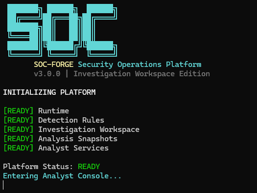
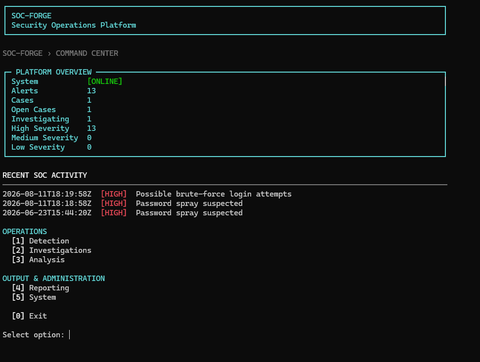
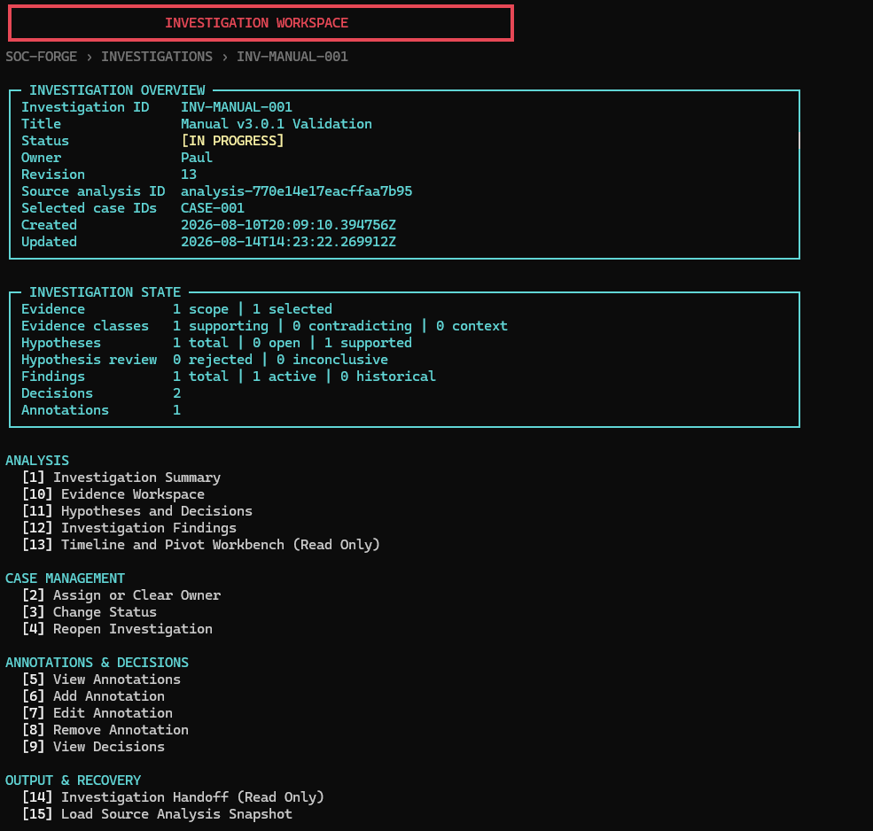

# Terminal UI Foundation

## Visual Tour

The v3.2 terminal redesign keeps the established console workflows while giving startup, routine navigation, and durable investigations a consistent visual hierarchy.







SOC-Forge v3.2 Slice 1 establishes shared presentation primitives for the Analyst Console. It improves formatting consistency and portability without changing console control flow, investigation semantics, persistence, analysis, or detection behavior.

## Architecture

`soc_forge.ui.terminal` contains pure renderers. They accept data and presentation options and return strings or immutable tuples of strings. They never read input, pause, clear the screen, dispatch actions, access repositories, or mutate analysis and investigation state. Controllers remain the sole owners of navigation and acknowledgement behavior.

The existing `soc_forge.ui.screen` helper remains responsible for screen clearing. Existing controllers and menus remain authoritative. The older `soc_forge.ui.panels.visible_len` entry point delegates to the shared ANSI-aware visible-length utility for compatibility.

## Primitives

The foundation provides compact application headers, titles, breadcrumbs, sections, dividers, bordered panels, metadata rows, semantic badges, bounded messages, grouped menus, and ANSI-safe width utilities.

Badges always include state text such as `[ACTIVE]`, `[SUPERSEDED]`, or `[HIGH]`. Color is supplementary and never carries meaning by itself. Unknown values receive a bounded neutral presentation rather than changing domain vocabulary.

## Width And Content Policy

The renderer uses an explicit width when supplied. Otherwise it asks the standard library for the current terminal width with an 80-column fallback. Width is clamped between 24 and 100 columns. Titles, breadcrumb segments, metadata values, badge labels, messages, panel content, and menu labels are bounded for presentation only; source values are never mutated.

Panels truncate overlong rows deterministically. Narrow terminals use compact metadata rows. Unicode borders are the default because they match the existing console, while callers can request ASCII borders and separators.

Visible-width calculations remove ANSI control sequences. ANSI-aware truncation appends a reset sequence when truncating styled content. Passing `ansi=False`, setting `NO_COLOR`, or using `TERM=dumb` produces readable text without color codes.

Python's standard string length is used after ANSI removal. Exact display width for uncommon double-width or combining Unicode characters is a documented limitation; adding a new width dependency is intentionally deferred.

## Initial Integration

The Command Center prints the compact application header before its existing dashboard. This passive integration introduces no input, delay, pause, dispatch, menu-number, repository, revision, snapshot, artifact, or `AnalysisResult` change.

Later v3.2 slices can migrate individual console surfaces deliberately. Slice 1 does not redesign the Investigation Workspace, Summary, Evidence, Findings, Handoff, startup experience, or web UI.

v3.2 Slice 1 establishes presentation primitives only. Existing console workflows remain behaviorally unchanged.


## Existing Startup Presentation

The Analyst Console continues to use its original large SOC ASCII logo and cyan/yellow SOC-Forge identity. The existing startup renderer reads the authoritative package version and presents readiness lines for Runtime, Detection Rules, Investigation Workspace, Analysis Snapshots, and Analyst Services beneath that branding. It remains the single startup implementation and does not use the compact Command Center application header as a replacement splash.

## Command Center And Navigation

The startup screen and Command Center have distinct roles. Startup retains the large branded SOC logo and readiness sequence; the Command Center uses the compact application header, SOC-FORGE > COMMAND CENTER breadcrumb, and existing dashboard projections for routine navigation.

The platform overview continues to use the established alert, case, case-status, and severity counts without introducing new calculations. Recent activity preserves the existing source order and three-item display limit. Navigation is grouped as Operations (1 Detection, 2 Investigations, 3 Analysis) and Output & Administration (4 Reporting, 5 System), with 0 retaining its existing exit behavior.

Top-level menus add a minimal SOC-FORGE > MENU breadcrumb while preserving their existing options, dispatch, input handling, and back navigation. Nested workspace redesign remains deferred to later slices. The same bounded-width and no-color behavior used by the terminal foundation applies to the Command Center.

v3.2 Slice 3 changes presentation and navigation hierarchy only; Command Center behavior and menu semantics remain unchanged.


## Investigation Workspace Presentation

The durable Investigation Workspace uses the shared terminal foundation and the same visual language as the Command Center. Its breadcrumb follows SOC-FORGE > INVESTIGATIONS > INVESTIGATION ID and is presentation context only.

The Investigation Overview panel consolidates the existing investigation ID, title, status, owner, revision, source analysis ID, selected case IDs, and created/updated timestamps. The Investigation State panel consolidates the existing annotation, decision, evidence, hypothesis, and Finding counts, including active and historical Finding distinctions. No new investigation metrics or projection architecture are introduced.

Navigation is visually grouped into Analysis, Case Management, Annotations & Decisions, and Output & Recovery. This visual order is independent of controller dispatch: the established numeric contract from 1 through 15, plus 0 for Back, remains authoritative and unchanged.

The workspace uses the centralized width policy. Metadata becomes more compact at narrow widths, bounded values truncate safely, and investigation IDs remain identifiable. Status text remains visible when ANSI is disabled through NO_COLOR, TERM=dumb, redirected output, or test capture.

Only the Investigation Workspace entry screen is migrated in this slice. Investigation Summary, Evidence, Hypotheses and Decisions, Findings, Timeline and Pivots, and Handoff internals remain deferred.

v3.2 Slice 4 changes Investigation Workspace presentation only. Investigation behavior, menu numbers, dispatch semantics, repository state, and revision semantics remain unchanged.


## Investigation Summary Presentation

The terminal Investigation Summary uses the shared v3.2 hierarchy beneath the breadcrumb SOC-FORGE > INVESTIGATIONS > INVESTIGATION ID > SUMMARY. A compact Investigation panel presents existing identity, status, owner, revision, source analysis, selected cases, and the prominent FULL or OFFLINE mode badge.

The Analyst Assessment panel displays the exact deterministic narrative from InvestigationSummaryService and may highlight existing active Finding metadata. Machine-generated detection context remains separate from analyst-selected evidence, hypotheses, decisions, active Findings, and historical or superseded Findings. Historical Findings remain visible with secondary styling and explicit lifecycle text.

Timeline chronology and all existing limitations have dedicated bounded sections. OFFLINE summaries retain durable analyst state while clearly naming unavailable machine and chronology context; snapshot loading remains explicit.

The drill-down menu preserves options 1 through 6 and 0 exactly. Visual grouping does not change dispatch, input, pause, Back, snapshot, persistence, or revision behavior. Text wraps through the centralized width policy, and badges retain their labels when ANSI is disabled.

v3.2 Slice 5 changes Investigation Summary presentation only. InvestigationSummaryService semantics, FULL/OFFLINE behavior, Finding lifecycle, drill-down behavior, persistence, and revision semantics remain unchanged.

## Analyst Workspaces

v3.2 Slice 6 applies the shared terminal presentation to the Evidence, Reasoning, and Findings workspaces. Their breadcrumbs use the current durable investigation ID and end in `EVIDENCE`, `REASONING`, or `FINDINGS`; breadcrumbs remain display context rather than navigation state.

The Evidence workspace presents authoritative scope, selection, and classification counts, then groups its unchanged options into review and management actions. Candidate cards retain source ordering and filtering, identify sensitivity without exposing additional telemetry, and selected-evidence cards keep classification, rationale, provenance, and case context visible. Existing sensitive-evidence acknowledgement prompts remain authoritative and unchanged.

The Reasoning workspace separates analyst hypotheses from analyst decisions. Its state panel uses the existing reasoning-service summary. Hypothesis cards retain assessment state, supporting and contradicting evidence relationships, and latest related decision; decision cards retain type, outcome, analyst, rationale, and relationships. Presentation does not create, assess, reopen, or link reasoning objects.

The Findings workspace separates `ACTIVE FINDINGS` from `HISTORICAL / SUPERSEDED FINDINGS`. Lifecycle remains explicit when color is unavailable, and historical Findings remain readable but read-only under the existing controller rules. Finding details preserve status, confidence, basis references, ATT&CK context, limitations, and supersession history while retaining the analyst-certainty disclaimer.

The visual reasoning flow is:

```text
source evidence
  -> analyst-selected Evidence
  -> analyst Hypothesis
  -> analyst Decision
  -> analyst-authored Finding
```

Menu numbers and dispatch contracts are unchanged. Controllers continue to own input, confirmation, pause, Back behavior, screen boundaries, and service calls. Renderers accept immutable values and return bounded text; they do not access repositories or perform mutations. The shared width and no-color policies apply at 100, 80, 60, and minimum fallback widths.

v3.2 Slice 6 changes analyst workspace presentation only. Evidence, Hypothesis, Decision, and Finding domain semantics, validation, persistence, revision behavior, provenance, lifecycle, and sensitive-data protections remain unchanged.

Long metadata labels may still be compacted by the shared fixed-label renderer at narrow widths. A broad metadata-label policy change is deferred to the final v3.2 terminal consistency and polish slice.

## Timeline, Pivot, And Handoff Workspaces

v3.2 Slice 7 completes the major Investigation terminal presentation migrations. The Timeline workspace uses the breadcrumb `SOC-FORGE > INVESTIGATIONS > <ID> > TIMELINE`, authoritative timed and untimed counts, and explicit `FULL` or `OFFLINE` source-analysis state. Machine and analyst activity retain textual origin badges. Timed chronology and untimed investigation context remain separate and preserve service ordering.

Timeline details and Pivot results use bounded shared panels while preserving existing filters, relationship reasons, overlays, matching semantics, entity normalization, menu numbers, pauses, and Back behavior. OFFLINE presentation does not fabricate chronology, load a snapshot, or recover source analysis automatically.

The Handoff workspace uses the breadcrumb `SOC-FORGE > INVESTIGATIONS > <ID> > HANDOFF` and presents revision, source availability, Finding lifecycle counts, and the current session's last-export state. Preview separates active Findings from historical or superseded Findings and preserves supersession metadata. Artifact availability, missing required or optional artifacts, and sensitive-content warnings remain explicit.

Handoff preview, export, validation, and last-result viewing remain read-only with respect to investigation state. Export still requires explicit sensitive-data acknowledgement. Existing-target cancellation, alternate roots, overwrite confirmation, fully staged validation before replacement, and failure preservation remain unchanged. Validation accepts a concrete bundle directory, such as `out/handoffs/INV-TEST-001`; the parent output root is not itself a bundle. Existing schema compatibility for 1.2, 1.1, and 1.0 remains unchanged.

Both workspaces use the centralized 100-, 80-, 60-, and minimum-width behavior. Status meaning remains textual under `NO_COLOR`, `TERM=dumb`, redirected output, and captured output.

v3.2 Slice 7 changes Timeline, Pivot, and Handoff terminal presentation only. Timeline construction, pivot semantics, handoff generation, bundle validation, export safety, schema compatibility, repository behavior, and investigation state semantics remain unchanged.

Broad fixed metadata-label behavior remains deferred to the final v3.2 terminal consistency and polish slice.

## Final v3.2 Visual Conventions

Slice 8 standardizes the completed terminal experience without changing product behavior.

- **Spacing:** migrated workspace screens use a breadcrumb, one blank line, a primary state or identity panel, one blank line between distinct sections, and one blank line before grouped navigation. Dense object lists may remain compact.
- **Metadata:** labels use a bounded proportion of available row width instead of a fixed 18-character column. Meaningful labels remain complete at normal widths while values retain useful scan space. Below 40 columns, metadata uses the established stacked fallback.
- **Badges:** status meaning is always present in brackets. Investigation, availability, evidence classification, hypothesis assessment, Finding status/lifecycle/confidence, severity, activity origin, readiness, and validation use centralized badge rendering. Color is supplementary.
- **Breadcrumbs:** migrated screens use the shared dim breadcrumb, consistent separator, uppercase workspace leaf, bounded segments, and the current investigation ID where applicable. Breadcrumbs remain presentation-only.
- **Messages:** semantic messages use one textual prefix such as `WARNING:`, `INFO:`, `OK:`, or `ERROR:`. Wrapped continuation lines align beneath the message body without repeating or interrupting the prefix.
- **Menus:** grouped menus retain two-space option indentation, `[n]` formatting, one blank line between groups, and a separate `[0] Back` or `[0] Exit` row. Menu numbers and dispatch remain controller-owned.
- **Long text:** analyst statements, rationales, conclusions, limitations, supersession reasons, and exact export paths wrap where identity or readability matters. Compact scan rows may truncate bounded display text without changing source data.
- **Attribution:** machine context remains explicitly machine-generated. Evidence, hypotheses, decisions, and Findings retain analyst attribution. Timeline origin remains textual as `[MACHINE]` or `[ANALYST]`.
- **Finding lifecycle:** active Findings receive current emphasis. Historical or superseded Findings remain fully readable with explicit `[SUPERSEDED]` state and secondary styling.
- **Read only:** Timeline/Pivot and Handoff surfaces use restrained read-only language describing behavior, not permissions or authorization.

The same semantic content remains available with `NO_COLOR`, `TERM=dumb`, redirected output, and captured output. Shared panels continue to support Unicode borders and the existing explicit ASCII fallback.

Rendering remains passive: it does not read input, clear screens, dispatch actions, invoke mutation services, change revisions, write repositories, alter snapshots or artifacts, or modify `AnalysisResult`.

### Known Limitations

Display width still uses Python string length after ANSI removal. Exact alignment for uncommon double-width or combining Unicode characters remains approximate, and no new width dependency is introduced. At minimum terminal width, very long labels and identifiers may truncate deliberately to preserve borders and usable value space. This affects presentation only; exact domain values remain unchanged and exact Handoff paths use wrapped presentation.

## Response Actions

Investigation Workspace option `16` opens the Response Actions workspace without changing options `1` through `15`. The screen uses shared breadcrumbs, panels, status/priority badges, semantic notices, grouped menus, width handling, and color fallbacks. It works from durable Investigation state without an active source analysis and records workflow only; it never executes remediation.

## Analyst Operations Queue

Command Center option 6 adds a compact ANALYST QUEUE summary after recent activity while preserving the existing dashboard content and option numbers. The SOC-FORGE > OPERATIONS QUEUE workspace uses the shared v3.2 header, breadcrumb, bounded panels, badges, grouped navigation, width handling, and no-color behavior.

Queue views are read-only filters over the deterministic Operations Queue projection. Selecting an item first shows its complete projection card, then offers direct navigation to the existing Response Action or Finding detail workflow. Returning refreshes the projection from durable Investigation state. Empty views state "No analyst attention items."

The terminal queue works offline because membership uses durable Investigation state only. It does not recover or infer source-analysis context, create a queue store, or execute remediation.

## Operations Prioritization Presentation

Operations Queue item cards include a concise Why Prioritized section containing the shared deterministic basis strings. Command Center shows only the highest-ranked item as Top Attention and does not duplicate the full queue or ranking rules. If the queue is empty, Top Attention is None.

The terminal consumes the same priority tier, operational state order, timestamp/identity tie-breaks, and top item projection as the web interface. Basis text wraps through shared width-safe metadata rendering and remains available with NO_COLOR. Rendering is passive and does not mutate queue or Investigation state.

## Operational Summary Presentation

Command Center now presents OPERATIONS OVERVIEW with deterministic counts, distinct Investigations represented, and Top Attention. The Operations Queue workspace adds OPERATIONS SUMMARY and bounded TOP PRIORITY WORK panels for the first three prioritized items. Empty queues explicitly show no current operational attention items.

These panels consume the same Operational Summary projection and priority basis as the queue; they do not scan, rank, or mutate work independently. Rendering remains offline-capable, width-safe, and passive, with no SLA, aging, activity tracking, automation, or AI ranking.


## v3.5 Console Architecture

Top-level numbers remain stable: Detection 1, Investigations 2, Analysis 3, Reporting 4, System 5, Operations Queue 6, and Exit 0.

Detection now groups future Detection Engineering destinations separately from Detection Results. Existing log analysis, simulation, and rules-only workflows remain under Detection Lab; alert viewing and search remain under Alert Explorer.

Detection Overview and Rule Catalog are implemented read-only workspaces. They
use the production bundled-rule loader and existing stored alerts, deterministic
rule-ID ordering, shared panels and metadata, width-safe truncation, `NO_COLOR`,
`TERM=dumb`, and ASCII fallback. Blank catalog input returns exactly one level.

Rule Explainability is a real read-only Detection workspace. Its rule selector
is deterministic by rule ID, and its detail screen uses shared overview, logic,
referenced-fields, aggregation, score-modifier, ATT&CK, output, metadata, and
limitations panels. Long configured values wrap without changing their meaning.
The Rule Catalog detail action reuses the same explanation screen. `[0] Back`
returns exactly one level and blank rule selection returns to Detection.

Detection Coverage and Detection Gaps remain bounded informational destinations.

Detection Lab uses a shared application header, Detection breadcrumb, bounded
menu, result metadata, triggered-rule list, ATT&CK panel, existing-artifact
panel, warnings, and explicit empty states. Its menu provides Analyze Telemetry
File, Run Attack Simulation, Evaluate Rules Only, View Last Lab Result, and
Back. Scenario ordering follows the simulator registry.

The latest successful result is session-only. Result rule numbers open the
shared Rule Explainability screen; `[0] Back` returns to the Lab result, and a
second `[0] Back` returns to the Lab menu. Rendering remains width-safe with
`NO_COLOR`, `TERM=dumb`, and ASCII fallback.

Detection Coverage provides Summary, ATT&CK Tactic, ATT&CK Technique, and
Unmapped Rules views. Detection Gaps provides All Gaps, Unmapped Rules, and
Disabled Coverage views. Both use deterministic ordering, shared panels,
metadata wrapping, explicit empty states, and rule drill-down through the
existing Rule Catalog detail and Rule Explainability screens.

Coverage copy says exactly what is counted and does not display a percentage.
Gap screens always state that no expected ATT&CK baseline is configured and
that analysis is limited to explicit metadata quality and enabled-rule
availability. They do not claim telemetry or sensor health.

Back navigation returns one level at a time. Both workspaces retain width-safe,
`NO_COLOR`, `TERM=dumb`, and ASCII-fallback behavior.

Security Analysis destinations describe future cross-investigation analysis without fake data or state. Attack Narrative and Attack Graph remain available through the Investigation Workspace reconstruction workflow. Reporting retains Analysis Report and ATT&CK Coverage while Investigation Handoff remains owned by Investigations. System removes Demo Case from primary analyst navigation and retains About SOC-Forge.

Unimplemented destinations use bounded informational panels after selection. Menu labels do not say Coming Soon. These screens preserve breadcrumbs, exact Back behavior, width limits, NO_COLOR, TERM=dumb, and ASCII fallback and do not modify analysis, investigation, queue, repository, or environment state. Platform Status is deferred until a shared authoritative readiness source exists.
